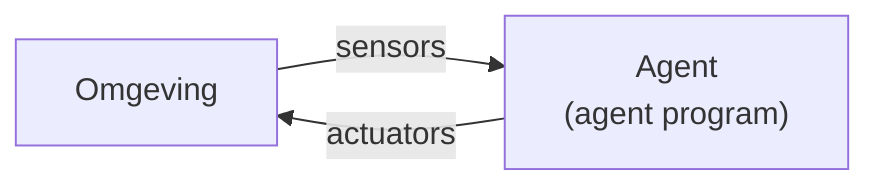
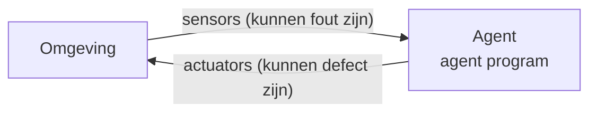
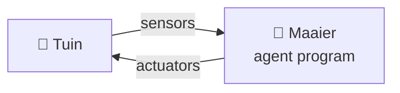
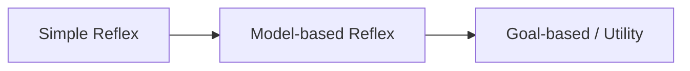
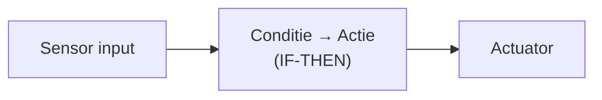
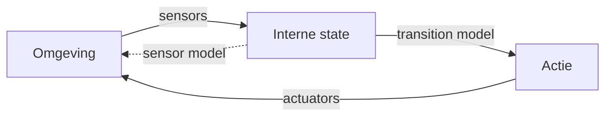

<<<<<<< HEAD
---
marp: true
theme: ap-theme
paginate: true
---

<!-- _class: title-slide -->

# Les 1 — AI vs ML
## Wat is het verschil?

---

<!-- _class: red-bg -->

# Intelligente agents

Een belangrijk denkkader

---

## Wat is een agent?

- Een agent is een systeem dat via **sensors** informatie binnenkrijgt uit zijn **omgeving**
- Op basis van die informatie en **interne logica** (het *agent program*) voert de agent via **actuators** acties uit
- Doel: de situatie in de omgeving verbeteren

---

## Sensors & Actuators — fouten

Zowel het observeren als het ageren kunnen fout gaan:

- Een **sensor** kan fout meten
- Een **actuator** kan een motor aansturen met als doel vooruit te gaan, maar als die motor een technisch defect heeft, blijf je alsnog staan

---

<!-- _class: interest-slide -->

## Een foutieve sensor — Boeing 737 Max

> *"Flawed information from a single external sensor fed into the system caused it to repeatedly push the planes' noses down as pilots struggled to keep them in the air before both crashes."*
> — [Wikipedia — Boeing 737 MAX](https://en.wikipedia.org/wiki/Boeing_737_MAX)

- **Single point of failure** in één sensor → leidde tot **2 vliegtuigcrashes** met bijna **350 doden**
- Netflix-documentaire: *"Downfall: The Case Against Boeing"*

---

<!-- _class: red-bg -->

# Agent function

---

## Agent function

- Een agent wordt bepaald door zijn **agent function**
- Voor elke mogelijke reeks inputs kunnen we bepalen wat de agent moet doen → een **state-action tabel**
- In de praktijk is die tabel **gigantisch**, soms zelfs **oneindig groot**

| Huidige staat | Actie |
|---|---|
| (gras, plaats) | Maaien |
| (niet gemaaid, plaats) | Rechtdoor |
| (gemaaid, plaats) | Links |
| (gemaaid, geen plaats) | … |

---

## State-action tabel — onhaalbaar groot

- Voor **schaken**: $10^{154}$ entries
- Ter vergelijking: aantal atomen in het universum ≈ $10^{80}$
- De state-action tabel is een **fata morgana**: ziet er fantastisch uit, maar kan in realiteit niet bestaan!

> Een agent function is de **theoretische** werking van een agent — een ideaal dat we in de praktijk benaderen.

---

## Voorbeeld — robotgrasmaaier

- Een robotgrasmaaier moet beslissen of hij **rechtdoor, links, rechts, achteruit** gaat, **stopt**, of de **maaier aan/uit** zet
- De omgeving — je tuin — geeft informatie:
  - Als de maaier **van het gras** rijdt → links, rechts of achteruit
- De robot past de omgeving aan: uiteindelijk is heel de tuin gemaaid

---

## Wat is AI in dit framework?

- De taak van **AI** is het ontwerpen van een **agent program** dat de agent function implementeert
- Dit is dus **concrete code**, geschreven voor een specifieke set actuatoren en sensors — de **agent architecture**
- Het heeft geen zin aan geavanceerd beeldherkenning te doen als er geen camera is!
- Deze cursus gaat over **agent programs**: hoe ontwerp en vergelijk je ze?

---

<!-- _class: red-bg -->

# Rationele Agents

---

## Wat maakt een agent rationeel?

- Voor elke geobserveerde input moet de agent handelen zodat zijn **doelfunctie** wordt gemaximaliseerd
- We hebben een **doelfunctie** (performance measure) nodig die bepaalt hoe goed een agent bezig is

**Voorbeeld — grasmaaier:**
- Doel: (zo snel mogelijk) de hele tuin maaien
- Doelfunctie: het percentage reeds gemaaid gras
- Een grasmaaier die in rondjes draait en stukken overslaat, is **niet rationeel**

---

## Rationele Agents — voorwaarden

Een rationele agent:

- ✅ Houdt rekening met **geobserveerde data** en **ingebouwde kennis**
- ❌ Is **niet alleswetend** — een autonoom voertuig kan niet weten dat er een niet-geconnecteerde auto achter de hoek met 100 km/u het kruispunt nadert. **Rationeel ≠ alleswetend!**
- ✅ Kan **leren** uit de historiek van inputs
- ✅ Doet dit **autonoom**

**Voorbeeld — 2 types robotmaaiers:**
1. Kent de vorm van de tuin **op voorhand**
2. Kent de tuin **niet** en moet deze eerst leren → tweede keer sneller

---

<!-- _class: red-bg -->

# Task environment

---

## Task environment — PEAS

Een agent kan enkel geëvalueerd worden op basis van de taak waarvoor hij is ontworpen:

- **P** — **P**erformance measure (doelfunctie)
- **E** — **E**nvironment (omgeving)
- **A** — **A**ctuators (wat het systeem kan aansturen)
- **S** — **S**ensors (wat het systeem kan waarnemen)

> De problemen = task environments; de agents = de oplossingen.

---

## PEAS — Robotmaaier

| Onderdeel | Beschrijving |
|---|---|
| **Performance** | Gras maaien, veiligheid, minimaal energieverbruik, minimale menselijke tussenkomst |
| **Environment** | Grasveld, bomen, planten, dieren (dynamisch), weersomstandigheden |
| **Actuators** | Sturen, banden (rechtdoor/achteruit), maaier aan/uit, waarschuwingslicht |
| **Sensors** | Hoogte gras, weerstand op wielen, navigatie t.o.v. basisstation, batterij, nabijheidssensor, temperatuur, vochtigheid |

---

## PEAS — OCR-paspoortscanner

| Onderdeel | Beschrijving |
|---|---|
| **Performance** | Foto automatisch omzetten naar beeld, minimale correctie via keyboard |
| **Environment** | Linux bestandssysteem; inputfolder met JPG/PNG (max 25 MB), outputfolder (max 10 GB), 4 GB RAM |
| **Actuators** | Files wegschrijven naar disk, resultaat weergeven op scherm |
| **Sensors** | Camera, keyboard input registratie |

---

<!-- _class: red-bg -->

# Soorten problemen

Welke eigenschappen hebben de problemen die we oplossen?

---

## Overzicht eigenschappen

| Eigenschap | Mogelijkheden |
|---|---|
| **Observeerbaarheid** | Volledig vs. Partieel |
| **Aantal agents** | Single vs. Multi (competitief / coöperatief) |
| **Zekerheid** | Deterministisch vs. Stochastisch |
| **Tijdsverloop** | Episodisch vs. Sequentieel |
| **Dynamiek** | Statisch vs. Dynamisch |
| **Waarden** | Discreet vs. Continu |

---

## Volledig vs. Partieel observeerbaar

**Volledig observeerbaar** (perfect information):
- Schaken, dammen, Go, Monopoly, Mens-erger-je-niet

**Partieel observeerbaar** (imperfect information):
- Poker, Patience

---

## Single vs. Multi-agent

| Type | Voorbeelden |
|---|---|
| **Single** | Kruiswoordraadsel, Patience |
| **Multi — 2-player (competitief)** | Schaken, dammen, Go |
| **Multi-agent (coöperatief)** | Zelfrijdende auto's, Scrabble, Monopoly |

---

## Deterministisch vs. Stochastisch

| Type | Kenmerk | Voorbeelden |
|---|---|---|
| **Deterministisch** | Geen onzekerheid | Schaken, dammen, Go |
| **Stochastisch** | Kansfactor (dobbelsteen) | Mens-erger-je-niet, Monopoly |

---

## Episodisch vs. Sequentieel

| Type | Kenmerk | Voorbeelden |
|---|---|---|
| **Episodisch** | Elke ronde onafhankelijk | Schaar-steen-papier, Roulette |
| **Sequentieel** | Vorige stappen beïnvloeden volgende | Lottotrekking (zonder teruglegging) |

---

## Statisch vs. Dynamisch

| Type | Kenmerk | Voorbeelden |
|---|---|---|
| **Statisch** | Omgeving verandert niet tijdens zet | Schaken (zonder klok), puzzels |
| **Dynamisch** | Omgeving verandert tijdens zet | Race- en schietspellen |
| **Semi-dynamisch** | Enkel performantiescore wijzigt met tijd | Schaken met klok, escape games |

---

## Discreet vs. Continu

| Type | Kenmerk | Voorbeelden |
|---|---|---|
| **Discreet** | Eindig aantal opties | Schaken, dammen, Go, bordspellen |
| **Continu** | Oneindig veel mogelijkheden | Autonomous driving, camera-detectie |

> Strikt genomen is een camera discreet ($256^3$ ≈ 16 miljoen kleuren), maar voor het blote oog is dat **continu**.

---

<!-- _class: red-bg -->

# Agent Programs

---

## Soorten agentprogramma's

De uitdaging voor AI: een programma schrijven dat een **rationele agent** oplevert **zonder** de hele state-action tabel te definiëren.

Drie basistypes:

1. **Simple Reflex agents**
2. **Model-based Reflex agents**
3. **Goal-based agents** / **Utility agents**

---

## Simple Reflex agents

- Handelen op basis van **huidige sensor input** — geen geheugen van het verleden
- Set regels: **conditie → actie** (IF → THEN)
- Eenvoudig, maar **beperkt intelligent**

**Voorbeelden bij mensen:**
- Hand terugtrekken bij verbranding
- Oog sluiten bij naderend voorwerp

---

<!-- _class: interest-slide -->

## Simple Reflex agents — beperking

Deze agents komen snel in de problemen bij **partieel observeerbare** situaties.

**Voorbeeld:** de sphex-wesp kan de geschiedenis van het verleden **niet** omzetten in slimmer gedrag.

▶️ [Bekijk de video](https://www.youtube.com/watch?v=YNvi_j2z96w)

---

## Model-based Reflex agents

- Houden in hun **geheugen** bij wat ze momenteel **niet kunnen waarnemen**
- Hebben een **interne state** → kunnen veranderingen over tijd vaststellen
- **Transition model:** weet wat het effect is van hun acties
- **Sensor model:** weet hoe veranderingen in de omgeving worden gereflecteerd door sensormetingen
- Bij elke nieuwe input wordt de interne state geüpdatet

---

## Model-based Reflex — voorbeelden

**Robotgrasmaaier:**
- Houdt een **kaart** bij van de tuin — waar is hij al geweest?
- **Transition model:** als de linkermotor harder draait dan de rechtermotor, stuurt de robot naar rechts

**Uitdaging:** bij veel mogelijkheden wordt brute force onmogelijk.

**Voorbeeld — Google Maps:**
- Kiest de optimale route van Antwerpen naar Parijs
- Checkt **niet** alle mogelijke wegen
- Gebruikt het doel "zo snel mogelijk" om een weg via Amsterdam uit te sluiten

---

## Goal-based agents & Utility agents

- Hebben een **doel** dat aangeeft of nieuwe situaties wenselijk zijn
- Geen "reflex" meer — de agent probeert de state **dichter bij het einddoel** te brengen
- Flexibeler dan reflex agents

**Twee varianten:**
| Type | Omschrijving |
|---|---|
| **Goal-based** | Enkel het einddoel is gekend |
| **Utility-based** | Interne **utility-functie** die wordt gemaximaliseerd — elke tussenpositie krijgt een score |

---

## Goal vs. Utility — voorbeeld

**Goal — route Antwerpen → Parijs:**
- Vind een **pad** dat start in Antwerpen en eindigt in Parijs
- Een pad = een rij steden met een weg ertussen

**Utility functie:**
$$-d(\text{huidige stad}, \text{nieuwe stad})$$

- Dit wil je **zo groot mogelijk** hebben
- Dus: een **zo klein mogelijke afstand** ($d$ = distance)

---

<!-- _class: red-bg -->

# Sorteren

Even een opfrissing

---

## Wat is sorteren?

- Het **ordenen** van een lijst op basis van een vergelijkingsmethode:
  - $<$ of $>$
  - Alfabetisch
  - Chronologisch
- Sorteren wordt al sinds de jaren 1950 bestudeerd
- Recent nog **nieuwe algoritmes** populair (o.a. Timsort, 2002)

---

<!-- _class: red-bg -->

# Complexiteit van algoritmes

---

## Hoe vergelijken we algoritmes?

- Een algoritme wordt **trager** naarmate er meer data is
- Afhankelijk van het systeem kan het sneller/trager gaan
- Sommige problemen zijn **parallelliseerbaar**, andere niet

---

## Big O-notatie

Dient om algoritmes onderling te vergelijken op:

- **Tijdsefficiëntie**
- **Geheugengebruik** (space complexity)

| Notatie | Betekenis |
|---|---|
| $O(1)$ | Wordt niet trager bij meer input |
| $O(n)$ | Dubbel zoveel input → dubbel zo traag |
| $O(n^2)$ | Dubbel zoveel input → $2^2 = 4\times$ trager |
| $O(b^d)$ | branchingfactor $b$ tot de macht diepte $d$ |

---

## Voorbeeld: 2 sorteeralgoritmes

| Eigenschap | Bubble Sort | Merge Sort |
|---|---|---|
| Complexiteit | $O(n^2)$ | $O(n \log n)$ |
| Geheugen | $O(1)$ | $O(n)$ |
| Stabiliteit | ✅ | ✅ |

---

## Voorbeeld: sorteeralgoritmes demo

---

## Verschillende sorteeralgoritmes

- **Insertion sort** — zien we in het labo
- **Quicksort** — zoals de naam het zegt, erg snel
- **Tree sort** — specifiek voor lijsten waar items worden toegevoegd
- **Timsort** (2002) — de standaard in Python en Java
- …

> Op Wikipedia vind je een goede overzichtstabel met alle eigenschappen per sorteeralgoritme.

=======
---
marp: true
theme: ap-theme
paginate: true
---

<!-- _class: title-slide -->

# Les 1 AI vs ML
## Wat is het verschil ?

---

## Intelligente agents

Een belangrijk denkkader

---

## Agents

• Een agent is een systeem dat via sensors informatie binnenkrijgt uit zijn omgeving. De agent gaat op basis daarvan en interne logica (agent program) via actuators acties uitvoeren op diezelfde omgeving, in de hoop een bepaalde situatie te verbeteren
Agent
•Sensors
•Agent program / agent function
•Actuators
Omgeving observeren ageren

---

## Agents

• Zowel het ‘observeren’ als het ‘ageren’ zijn dingen waar fouten kunnen optreden:
• Een sensor kan fout meten
• Een actuator kan een motor aansturen met als doel vooruit te gaan, maar als die motor een technisch defect heeft, blijf je alsnog staan
Agent
•Sensors
•Agent program
•Actuators
Omgeving observeren ageren

---

## Een foutieve sensor – 737 Max

• ‘Flawed information from a single external sensor fed into the system caused it to repeatedly push the planes' noses down as pilots struggled to keep them in the air before both crashes.’ [bron: https://en.wikipedia.org/wiki/Boeing_
737_MAX ]
• Dit systeem had een ‘single point of failure’ in de vorm van die sensor. Het leidde tot 2 vliegtuigcrashes, met bijna 350 doden.
• Netflix: “Downfall: the case against
Boeing”

---

## Agent function

• Een agent is bepaald door zijn agent function. In principe zou je voor elke mogelijk reeks van inputs, kunnen bepalen wat de agent moet doen (een tabel maken) – die tabel kunnen we de state-action tabel noemen
• In de praktijk is de tabel gigantisch, soms zelfs oneindig groot
• Voor schaken: 10ଵହ଴entries
• Ter info, aantal atomen in universum: circa 10଼଴
• De agent function is de theoretische werking van een agent
Actie
Staat (gras, plaats rechtdoor)
Maaien (niet gemaaid, plaats)
Rechtdoor (gemaaid, plaats)
Links (gemaaid, geen plaats)
…
De state-action tabel is dus een soort fata morgana: ziet er fantastisch uit, maar kan in realiteit niet bestaan !

---

## Agent function

Voorbeeld:
• Een robotgrasmaaier moet beslissen of hij rechtdoor, links, rechts, achteruit gaat, stopt, de maaier aan of afzet. De omgeving van de robot – je tuin – geeft informatie: als de maaier van het gras rijdt, zou het systeem links of rechts of achteruit moeten gaan. De robot past de omgeving ook aan: idealiter is op het einde heel je tuin gemaaid

---

## Wat is AI  in dit framework ?

• De taak van AI is om een agent program te ontwerpen dat de agent function implementeert
• Dit is dus concrete code
• Deze is ontworpen voor een specifieke set actuatoren en sensors – de agent architecture
• Het heeft geen zin om aan geavanceerd beeldherkenning en object-detectie te doen als er geen camera of camerabeeldenstroom is
• Deze cursus gaat over agent programs, hoe ze te ontwerpen en onderling te vergelijken

---

## Rationele Agents

• Wat maakt een agent ‘rationeel’ ?
• Voor elke geobserveerde input, moet de agent handelen zodat zijn ‘doelfunctie’ wordt gemaximaliseerd
• Dus we hebben een doelfunctie nodig die bepaalt hoe goed een agent bezig is
Voorbeeld:
• Het doel van de grasmaaier is (zo snel mogelijk) de hele tuin maaien. Een doelfunctie (performance measure) zou kunnen zijn: het % reeds gemaaid gras.
• Een grasmaaier die dus in rondjes draait en bepaalde stukken van de tuin niet maait, is niet rationeel.

---

## Rationele Agents - voorwaarden

• Wat maakt een agent ‘rationeel’ ?
• Bovendien houdt een rationele agent rekening met zijn geobserveerde data, en eventuele ingebouwde kennis
• Echter, de agent kan onmogelijk alles weten: een autonoom voertuig kan niet weten dat er een niet-geconnecteerde auto achter de hoek met 100 km/u het kruispunt nadert. Rationeel ≠ alleswetend!
• In onze definitie gaan we er ook vanuit dat de agent op basis van de historiek aan inputs in staat is om te leren
• Bovendien moet een rationele agent dit autonoom kunnen doen
Voorbeeld:
• Hier kunnen we een onderscheid maken tussen 2 soorten robotmaaiers:
• Robotmaaiers die de vorm van jouw tuin kennen voordat ze aan hun rondje beginnen
• Robotmaaiers die nog geen idee hebben hoe de tuin eruit ziet. Deze moeten eerst de vorm van de tuin leren. De tweede keer gras maaien moet hier een stuk sneller zijn.

---

## Task environment

• Een agent kan enkel worden geëvalueerd op basis van de taak waarvoor hij is ontworpen
• Dit zijn in essentie de ‘problemen’, de agents zijn de ‘oplossingen’
• Een task environment:
PEAS (POAS in
Nederlands)
• P: Performance measure
• E/O: Environment /
Omgeving
• A: actuators, wat het systeem kan aansturen
• S: sensors, wat het systeem kan ‘voelen / zien / percipiëren’

---

## Task environment

• Voor de robotmaaier
Sensors
Actuators
Environment
Performance
Agent type
Hoogte gras, weerstand op wielen, navigatie tov basisstation, batterij autonomie, korte‐nabijheid sensor, temperatuur, vochtigheid gras
Sturen, banden rechtdoor, achteruit, maaier op / af, waarschuwingslicht je,
Grasveld, bomen, planten, dieren (dynamisch), weersomstandighe den
Gras maaien, veilig tegen snij‐ incidenten, minimaal energieverbruik, minimale menselijke tussenkomst
Robotmaaier

---

## Task environment

• Voor een automatische scan van een paspoort op het gemeenteloket
Sensors
Actuators
Environment
Performance
Agent type
Camera, keyboard input registratie
Files wegschrijven naar disk, resultaat weergeven op scherm
Linux file omgeving; inputfolder
Jpgfiles, PNG‐files, max 25mb
Outputfolder max 10 gb HD, systeem met 4GB RAM,
Keyboard input
Foto automatisch omzetten in beeld, minimize extra correctie keyboard input
OCR Scanner (optical character recognition)

---

## Wat voor soort problemen lossen we op ?

• Observeerbaarheid
• Perfect vs inperfect
• Single vs multi
• Multi: competitive vs cooperative
• Deterministisch vs stochastisch
• Episodisch vs Sequentieel
• Statisch vs Dynamisch
• Discreet vs Continu

---

## Spelletjes van allerlei soort

---

## Fully observable vs partially observable

• Volledig observeerbaar:
• Schaak
• Dammen
• Go (chinees bordspel)
• Monopoly
• Mens-erger-je- niet
• Dit noemen ze ook wel perfect information games
• Partieel observeerbaar
• Poker
• Patience
• Dit noemen ze ook inperfect information games

---

## Single vs Multi

• Single
• Kruiswoordraadsel
• Patience
• Multi
• 2-player:
• Schaken, dammen, go
• Dit zijn typisch competitieve problemen
• Multi-agent
• Zelfrijdende auto’s
• Cooperatief systeem
• Scrabble
• Monopoly

---

## Single vs Multi

• Deterministisch
• Schaken, dammen, go
• In volledig observeerbare, deterministische spellen moet de speler geen rekening houden met onzekerheid
• Stochastisch
• Mens-erger-je-niet
• Monopoly
• (alles met een dobbelsteen)

---

## Episodisch vs sequentieel

• Episodisch
• Schaar-steen- papier
• Roulette
• Sequentieel
• Lottotrekking (ballen worden niet teruggelegd)

---

## Statisch vs dynamisch

• Statisch
• Schaak (zonder klok)
• Kruiswoordraadsel
• Heel veel bordspellen
• Puzzels
• Dynamisch
• Veel computerspellen, zoals race-spellen, schietspellen, …
• Semi-dynamisch: indien enkel de performantie- score wijzigt met de tijd
• Schaak met een klok
• Escape games

---

## Discreet vs continu

• Discreet
• Schaak, dammen, go
• Bijna alle bordspellen
• Continu
• Typisch voor échte problemen
• Autonomous driving
• Camera-detecting algorithms
• Strikt genomen is dit discreet, maar in de praktijk continu. Er zijn namelijk op een typische camera minstens 256ଷ kleurtinten -> 16 miljoen kleuren, voor het blote oog is dat continu
• Of voor spellen met echte stukken, zoals dit knikkerbord:

---

## Agent Programs

---

## Agents - Soorten

• De uitdaging voor AI is het schrijven van een programma dat een rationele agent oplevert zonder heel de state-action tabel de definiëren.
We geven 3 soorten AI systemen, die eigenlijk de basis vormen van alle onderliggende systemen:
• Simple Reflex agents
• Model based Reflex agent
• Goal based agents; Utility agents

---

## Simple Reflex agents

• Ageren op basis van de huidige sensor input
• Geen rekening houden met oudere input
• Deze hebben dus een set regels: conditie actie
IF THEN
• Ze zijn eenvoudig, maar het is duidelijk dat ze qua intelligentie beperkt zijn
• Mensen hebben zelf zulke ingebouwde “reflexen”:
• Hand terugtrekken bij verbranding
• Oog sluiten bij naderen voorwerp

---

## Simple Reflex agents

• Deze agents komen snel in de problemen in situaties die niet volledig observeerbaar zijn (imperfect information)
• We kijken naar een sphex wesp, die niet in staat is om de geschiedenis van het verleden om te zetten in slimmer gedrag:
• https://www.youtube.com/ watch?v=YNvi_j2z96w

---

## Model-based Reflex agents

• Deze agents houden in hun geheugen bij wat ze momenteel niet kunnen waarnemen
• Heeft dus een interne state
• Kan dus veranderingen over de tijd vaststellen in de omgeving
• ‘Weet’ wat het effect is van haar acties – dit noemen we een transition model
• ‘Weet’ hoe veranderingen van de omgeving worden gereflecteert door sensormetingen – sensor model
• Bij elke nieuwe input gaat dit model zijn interne state moeten updaten
• De robotgrasmaaier heeft een soort kaart van jouw tuin, waar hij al wel en niet is geweest
• Het transition model van de grasmaaier weet dat als hij de linkermotor harder laat draaien dan de rechtermotor, de robot naar rechts stuurt

---

## Model-based Reflex agents

• Deze agents krijgen het moeilijk wanneer er veel mogelijkheden zijn.
• Zoekproblemen hebben typisch meer intelligentie nodig, omdat er niet genoeg tijd is om heel de zoekruimte te checken
• Wanneer ‘brute force’ niet meer voldoende is
• Voorbeeld
• Google Maps kiest de optimale route tussen
Antwerpen en Parijs. Het heeft geen tijd om alle mogelijke wegen te checken. Het gebruikt onderweg het doel ‘zo snel mogelijk van
Antwerpen naar Parijs geraken om bijvoorbeeld een weg via Amsterdam uit te sluiten

---

## Goal based agents en utility agents

• Deze agents hebben steeds een doel wat aangeeft of nieuwe situaties wenselijk zijn of niet.
• Dit is geen “reflex” meer, het probeert iets te doen wat de state dichter bij de uiteindelijke uitkomst brengt
• Het is meer flexibel.
• Soms wordt er een onderscheid gemaakt tussen
• Goal Based – enkel het einddoel is gekend
• Utility Based – hier heeft het systeem intern een utility functie, die het wil maximaliseren – op een tussenpositie kan er ook worden aangegeven of dit beter of slechter is dan de vorige
• Een goal/doel voor de zoekfunctie van Antwerpen naar Parijs is om een pad te vinden dat start in
Antwerpen en eindigt in Parijs.
• Een pad is dan een rij steden met een weg ertussen
• Een utility functie is dan heel concreet:
• െ𝒅 huidige stad , nieuwe stad
Dit wil je zo groot mogelijk hebben, dus een zo klein mogelijk afstand (d van distance)

---

## Sorteren

Even een opfrissing

---

## Wat is sorteren ?

• Onder sorteren verstaan we het ordenen van een lijst, waarbij er een gekende manier is om 2 items in de lijst onderling te vergelijken que grootte:
• < of >
• Alfabetisch
• Chronologisch
• Sorteren werd al gedaan in de jaren vijftig, maar vrij recent zijn er nog nieuwe algorithms gepubliceerd én zeer populair (Timsort, 2002)

---

## Complexiteit van Algoritmes

• Hoe kunnen we vergelijken of het ene algoritme sneller is dan het andere ?
• Een algoritme wordt sowieso trager als we er meer data aan geven
• Afhankelijk van het systeem waarop het algoritme wordt gehost kan het ook sneller / trager gaan
• Veel hangt ook af of het probleem parallelliseerbaar is

---

## Big O Notation

• Dit dient om algoritmes onderling te vergelijken
• Efficiëntie in tijd
• Efficiëntie in geheugengebruik ('space complexity')
• O(1)
• Het programma wordt niet trager bij meer input
• O(n)
• Het programma wordt dubbel zo traag bij dubbel zoveel input
• O(n²): het programma wordt 4 (2²) keer zo traag bij dubbel zoveel input.

---

## Voorbeeld: 2 sorteeralgoritmes

Bubble Sort
Merge Sort

---

## Voorbeeld: 2 sorteeralgoritmes demo

---

## Verschillende sorteeralgoritmes

• Insertion sort (gaan we bekijken tijdens het labo)
• Quicksort
• Zoals de naam het zegt, erg snel
• Tree sort
• Specifiek voor lijsten waar items aan worden toegevoegd
• …
• Op wikipedia vind je een goede overzichtstabel:

---

## History slide of the day

---

## De inceptie van AI – 1943-1956

• Jaren 50: Oplossen van simpele spelletjes en puzzels - pionierstijdperk
• 1958: J. McCarthy creëert programmeertaal Lisp: eerste taal waarmee je nieuwe regels kon toevoegen zonder het te herprogrammeren
• Microworlds:
• SAINT: integralen oplossen
(1963)
• ANALOGY: vorm- problemen uit IQ tests
(1967)
• Block world
• Soort heel simplistische versie van Minecraft
• SHRDLU, een eerste chatbot (Terry Winograd)
>>>>>>> upstream/main
